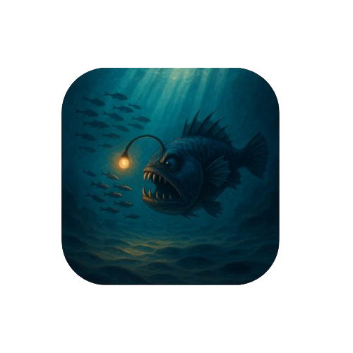

<h1 align="center">
   
  
   
</h1>

<h1 align="center">Aquarium: Next-Gen Underwater Immersion</h1>

  

  Awarded one of the best project out of 51 teams in EPFL’s CS341 course competition, where each group submitted a 60 s video and did a live demo.  
  Watch our winning trailer below!

  <!-- JavaScript -->
  
  <!-- HTML5 -->
  
  <!-- GLSL -->
  

  <a href="#overview">Overview</a> •
  <a href="#features">Features</a> •
  <a href="#getting-started">Getting Started</a> •
  <a href="#controls">Controls</a> •
  <a href="#credits">Credits</a>

https://github.com/user-attachments/assets/fd4fe8e2-d547-4485-a8e7-057be159f8d1

---

## Overview

Aquarium is a browser-based, real-time underwater ecosystem built with WebGL, GLSL, and JavaScript. It combines advanced rendering techniques: volumetric god rays, depth-of-field, and procedural terrain, with CPU-driven boid simulations for lifelike fish behavior. Users can switch perspectives (predator, prey, or free camera), tweak visual effects on the fly, and dive into a dynamic ocean scene that runs smoothly in any modern browser.

## Features

- **Volumetric God Rays**  
  Realistic light shafts penetrate the water using screen-space ray marching through a fog volume.

- **Depth-of-Field**  
  Post-process blur sharpens or softens regions based on adjustable focal distance, creating cinematic depth.

- **Procedural Seafloor**  
  A flat mesh displaced by 2D fractal noise forms dunes, trenches, and varied terrain; parameters can be tweaked in real time.

- **Multi-Species Boid Simulation**  
  Two prey species (standard fish and “Nemo” fish) flock together, while an anglerfish predator hunts them, resulting in emergent chase and scatter behavior.

- **Interactive Camera & UI**  
  Attach the camera to any fish (predator or prey) or switch to a free-roam view. UI sliders and toggles let you adjust DoF, god rays, noise scale, fog density, lighting, and more.

- **Custom Meshes & Textures**  
  Imported fish models (Trout and Nemo) and a custom-modeled anglerfish predator bring visual realism to the scene.

## Getting Started

1. **Clone the repository**

2. **Open in Browser**  
    Simply open `index.html` in any modern browser, no build step required. All shaders and assets are included.
    
3. **Adjust Settings**  
    Use the on-screen UI panel (top-left) to enable or disable effects, adjust focal distances, tweak terrain or lighting parameters, and set boid counts.
    

## Controls
    
- **Mouse Drag:** Rotate camera view
    
- **UI Panel:**
    
    - Toggle Depth-of-Field and God Rays
        
    - Adjust focus distance, noise scales, fog density, light strength
        
    - Change camera mode (free, predator, prey) via dropdown
        
    - Modify “Max Boids” to balance performance and crowd density
        

## Credits

- **Course:** CS-341 (Computer Graphics), EPFL, Spring 2025
    
- **Team Members:**  
    • Youcef Amar  
    • Erik Hübner  
    • André Cadet
