# Aquarium

<div style="text-align: center;">
<video height="300" autoplay loop muted playsinline>
	<source src="videos/abstract/PROJECT.mp4" type="video/mp4" />
	Your browser does not support the video tag.
</video>
</div>

## Abstract

This project presents an interactive aquarium simulation developed using WebGL, GLSL, and JavaScript, created in the context of CS-341 Computer Graphics course. The simulation features a visually rich environment with procedurally generated 2D terrain meshes, depth of field effects, and volumetric lighting to produce realistic god rays. A predator fish patrols the environment, while smaller fish, modeled using a boid simulation, exhibit flocking and evasion behavior. Users can attach the camera to either the predator or a pre-selected boid to observe their movement dynamics in real time. The application provides interactive controls that allow users to modify terrain structure, lighting parameters, and post-processing effects, making the aquarium fully customizable. This project demonstrates the integration of advanced graphical and behavioral techniques in a real-time, browser-based environment.

## Overview

In this project, we set out to simulate a dynamic underwater ecosystem that combines advanced rendering techniques with simple but effective behavioral rules. The key visual and interactive components are:

1. **Underwater Lighting & Atmosphere**

   - **Volumetric God Rays**: We use screen-space ray marching through a participating fog volume to produce convincing shafts of light filtering down through the water column.
   - **Depth-of-Field**: A post-process blur on the GPU that smoothly shifts focus between foreground and background elements, driven by a user-adjustable focal band.

2. **Procedural Seafloor with Trenches**

   - A flat mesh is displaced by a 2D fractal noise function, creating dunes and deep ocean-like holes to give the floor varied depth and realistic detail.

3. **Multi-Species Flocking and Evasion**

   - **Two Prey Species**: standard fish and “Nemo” fish, each form their own schools via a CPU-based boid algorithm and only align and avoid within their species.

   - **Predator Fish (an anglerfish)** pursues any nearby prey, reacting to both species but never altering prey–prey interactions, resulting in emergent chase and scatter behavior.

4. **Interactive Exploration & Control**

   - Users can attach the camera to either the predator or any individual prey fish, offering first-person chase or flocking viewpoints.
   - A compact UI provides toggles and sliders for:

     - Enabling/disabling DoF and god rays
     - Adjusting focus range, noise parameters, and more !

   - These controls allow real-time tweaking of both visual effects and ecosystem dynamics.

<div style="text-align: center;">
<video height="400" autoplay loop muted playsinline>
	<source src="videos/projectOverview.mp4" type="video/mp4" />
	Your browser does not support the video tag.
</video>
</div>

_Figure: A detailed view showing volumetric god rays, depth-of-field blur, the trench-sculpted seafloor, and the anglerfish predator with a school of boid-driven prey fish._

## Feature validation

<table>
	<caption>Feature Summary</caption>
	<thead>
		<tr>
			<th>Feature</th>
			<th>Adapted Points</th>
			<th>Status</th>
		</tr>
	</thead>
	<tbody>
		<tr>
			<td>Noise Functions for 2D Terrain Generation (Surfaces)</td>
			<td>5</td>
			<td style="background-color: #d4edda;">Completed</td>
		</tr>
		<tr>
			<td>Depth of field</td>
			<td>5</td>
			<td style="background-color: #d4edda;">Completed</td>
		</tr>
		<tr>
			<td>Meshes for fishes</td>
			<td>10</td>
			<td style="background-color: #d4edda;">Completed</td>
		</tr>
		<tr>
			<td>God Rays via Volumetric lighting</td>
			<td>15</td>
			<td style="background-color: #d4edda;">Completed</td>
		</tr>
		<tr>
			<td>Boids</td>
			<td>20</td>
			<td style="background-color: #d4edda;">Completed</td>
		</tr>
	</tbody>
</table>

### Noise Functions for 2D Terrain Generation (Surfaces)

#### Implementation

##### General Implementation

The implementation of the 2D Terrain Generation stayed mainly the same as in the template project provided.
Which means that in the scene, we need to include a `procedural_texture_generator` which will be responsible for computing the height map.
It is in the `noise_sr.js` that will occur the main changes we made.
We modified the shader main of the `noise_sr.js` which was declaring the main dynamically by taking as argument the type of function it used to generate noise. Now the function is hardcoded and it is the function we declared in the `noise.frag.glsl`, `tex_sand`.

##### Shader Noise Implementation

Let's get into the implementation of the `tex_sand` method in the `noise.frag.glsl` file since it is the main core of this feature. To get started we wanted to define to different biomes, one that looks like the average perlin noise and one that would be more like a world with different floors.
With these two worlds we decided to fix the border to the `y` coordinate of the `uv` argument. Which means that in the `tex_sand` method we are just differentiating two cases.

Let's get to the helper functions that enable us to generate the noise in the two different cases.

##### `height_flatbiome`

This function is a basic implementation of the perlin noise with some simple tweaks. We have the compute the basic height like this :

$h = \textbf{fbm}(uv) * \textbf{fb\_perlin\_multiplier} + \textbf{fb\_perlin\_offset}$

Where `fb_perlin_multiplier` and `fb_perlin_offset` are adjustable parameters.
Then to add a little bit of randomness in the terrain we consider the border `y` between the two terrains and we compare this height `h` to the border. If the height is smaller there is one case and if it is higher then we just return `h`.
In the case we are below the border threshold, we try to make the low areas of the terrain more detailed and dynamic. This is made like this :

```glsl
float depth = border - h;
float feature = perlin_fbm(uv * fb_feature_perlin_argument_multiplier) * pow(depth, fb_feature_exponent);
return h - feature * fb_feature_perlin_multiplier;
```

##### `height_complex`

This function is a more sophisticated terrain generation technique that mixes multiple terrain types and adds discrete elevation steps (terracing), giving it a more natural and stylized look. It is based on the standard Perlin fBM but adds non-linear shaping, blending, and quantization of terrain heights.

We start by computing the base terrain height like this:

```glsl
float base = fbm(uv) * comp_perlin_multiplier + comp_perlin_offset;
```

This is the same structure as in `height_flatbiome`:

```glsl
h = fbm(uv) * comp_perlin_multiplier + comp_perlin_offset
```

Where `comp_perlin_multiplier` and `comp_perlin_offset` are tunable parameters that control the amplitude and vertical position of the base terrain.

Next, we create two shaped versions of this base height:

```glsl
float flat_  = adjust_elevation(base, comp_flat_exponent);
float sharp = adjust_elevation(base, comp_sharp_exponent);
```

The `adjust_elevation` function is:

```glsl
float adjust_elevation(float h, float exponent) {
    return pow(h, exponent);
}
```

This function transforms the base elevation non-linearly:

- If `exponent < 1`, the terrain gets flattened (useful for valleys or plateaus).
- If `exponent > 1`, the terrain gets sharpened, exaggerating peaks and cliffs.

So here we create two versions:

- `flat_` – using a small exponent → smoother terrain
- `sharp` – using a large exponent → pointy terrain

Then, we compute a control factor that mixes between the flat and sharp terrain types:

```glsl
float ctrl  = combine_controls(uv, comp_ctrl_scaleA, comp_ctrl_scaleB, comp_ctrl_weightA);
```

```glsl
float combine_controls(vec2 p, float scaleA, float scaleB, float weightA) {
    float a = fbm(p * scaleA);
    float b = fbm(p * scaleB);
    return mix(a, b, weightA);
}
```

This function creates a blend factor `ctrl` between [0, 1] using two different fBM noises:

- It gives spatial variation in how much flatness or sharpness is applied.
- You can think of this as a moisture/temperature-based biome control, where different zones have different terrain styles.

Now we blend the two elevation shapes using this control:

```glsl
float mixed = mix(flat_, sharp, ctrl);
```

So:

- If `ctrl ≈ 0`, the result is mostly flat.
- If `ctrl ≈ 1`, it favors the sharp version.
- In between, it interpolates both.

Finally, we apply a terrace effect:

```glsl
float terr = terrace(mixed, comp_steps);
```

The `terrace` function is:

```glsl
float terrace(float h, float steps) {
    return floor(h * steps) / steps;
}
```

This discretizes the height into `steps` number of horizontal slices — similar to elevation layers in stylized terrain or farming terraces. It makes the terrain look more artificial or stepped, which is a stylized and artistic control over the terrain output.

#### Validation

To validate the feature, we are going to look at some of the main parameters of the 2D noise terrain generation.

First we can look at the difference between the first type of terrain and the complex terrain.

<div style="text-align: center;">
<video height="300" autoplay loop muted playsinline>
	<source src="videos/2D-FB-2terrains.mp4" type="video/mp4" />
	Your browser does not support the video tag.
</video>
</div>
<figcaption style="text-align: center;">Two terrains change.</figcaption>

Furthermore we can see that when we set the border to the max value, the terrain also becomes shaper which is consequence of comparing the height of the perlin fbm in the `height_flatbiome` function with the `border` parameter.

Second we can look at the exponent variable which sharpens the lower parts of the "basic" terrain generated with some fbm functions:

<div style="text-align: center;">
<video height="300" autoplay loop muted playsinline>
	<source src="videos/2D-FB-Exponent.mp4" type="video/mp4" />
	Your browser does not support the video tag.
</video>
</div>
<figcaption style="text-align: center;">Exponent making lower height more precise.</figcaption>

Then we can look at the weight of the `combine_control` function used in the complex terrain. We can see that if we move the main component the terrain has smaller holes appear and if we decrement it, the terrain becomes flatter as we can see below:

<div style="text-align: center;">
<video height="300" autoplay loop muted playsinline>
	<source src="videos/2D-FB-ctrlWeight.mp4" type="video/mp4" />
	Your browser does not support the video tag.
</video>
</div>
<figcaption style="text-align: center;">Ctrl argument.</figcaption>

We can then look at the color gradient that was implemented by adapting the existing material in the `materials.js` file and blending the colors together:

```glsl
if (height > deep_water_level + blendWidth) {
        // fully sand: no gradient at all
        material_color = sand_color;
        shininess     = sand_shininess;
}
else if (height < deep_water_level - blendWidth) {
	// fully deep water
	material_color = deep_water_color;
	shininess     = deep_water_shininess;
}
else {
	// in the narrow band around deep_water_level, blend
	// t=0 at (h = deep_water_level - blendWidth)
	// t=1 at (h = deep_water_level + blendWidth)
	float t = smoothstep(
		deep_water_level - blendWidth,
		deep_water_level + blendWidth,
		height
	);
	material_color = mix(deep_water_color, sand_color, t);
	shininess     = mix(deep_water_shininess, sand_shininess, t);
}
```

We can see that we implemented some sort of gradient to smoothen the transition from sandy terrain to watery terrain:

{width="500px"}

### Depth-of-Field

#### Implementation

Depth-of-Field (DoF) is performed as a full-screen post-process on the GPU. We render a screen-filling quad using two GLSL shaders, one to pass depth information and one to blur based on that depth.

1. **Shaders**:

   The vertex shader (`depth_of_field.vert.glsl`) runs once per quad vertex and performs two tasks. First, it computes the view-space depth of each vertex by transforming it into camera space and measuring its distance from the eye:

   ```glsl
   cam_depth = length(mat_model_view * vec4(vertex_positions, 1));
   ```

   Second, it forwards the clip-space position to the fragment stage so that normalized UV coordinates can later be reconstructed.

   The fragment shader (`depth_of_field.frag.glsl`) operates on every screen pixel to blend a sharp and a blurred version of the scene color based on per-pixel depth. It begins by reconstructing texture coordinates from clip space:

   ```glsl
   vec2 uv = (canvas_pos.xy / canvas_pos.w) * 0.5 + 0.5;
   ```

   A simple box blur is then performed around these UVs: the shader loops over a square window of radius `size`, clamps sample coordinates to the \[0,1] range to prevent border artifacts, accumulates the sampled colors, and averages them:

   ```glsl
   const int size = 10;
   vec3 sum   = vec3(0.0);
   float count = 0.0;
   for (int i = -size; i <= size; ++i) {
   	for (int j = -size; j <= size; ++j) {
      		vec2 offset   = vec2(float(i)/canvas_width,
      							float(j)/canvas_height);
      		vec2 sampleUV = clamp(uv + offset, 0.0, 1.0);
      		sum   += texture2D(color_texture, sampleUV).rgb;
      		count += 1.0;
      	}
   }
   vec3 blurred = sum / count;
   ```

   Next, the shader computes a focus factor by comparing the fragment’s depth (`cam_depth`) against the user-controlled focal band: depths at or below `minFocusDistance` are fully sharp (focus = 0), and depths at or above `maxFocusDistance` are fully blurred (focus = 1):

   ```glsl
   // depth ≤ minFocusDistance → focus = 0 (sharp)
   // depth ≥ maxFocusDistance → focus = 1 (blurred)fragments are fully blurred
   float focus = smoothstep(minFocusDistance,
      			maxFocusDistance,
      			cam_depth);
   ```

   Finally, it fetches the original (sharp) scene color and linearly interpolates between that and the blurred result using the computed focus value:

   ```glsl
   // get the depth value from the depth texture
   // (just the color at that pixel)
   vec4 focusedColor = texture2D(color_texture, uv);

   // mix the two colors based on the focus value
   gl_FragColor = mix(focusedColor, unfocusedColor, focus);
   ```

2. **Pipeline Integration**:

   When the user enables Depth-of-Field via `ui_global_params.depth_of_field`, the `SceneRenderer` invokes the DoF pass:

   ```js
   this.depth_of_field.render(scene_state, this.texture("shadows_and_base"));
   ```

   Under the hood, the `DepthOfFieldShaderRenderer` binds the fully rendered scene texture (`shadows_and_base`) along with the DOF parameters, and then draws a single screen-filling quad. This one draw call applies the DOF shaders across every pixel of the frame, producing the final blurred output. No per-object redraws or additional framebuffers are required.

3. **UI Controls**:

   Depth-of-Field is managed through a simple UI panel. A toggle button labeled “Add Depth Of Field” turns the effect on or off. Even when disabled or enabled, the underlying scene (boids, terrain, god-rays) still renders normally.

   > Note:
   > If you want to enable DoF, you will need to expand it section in the UI controls

   Two sliders define the focal band. **Focus Distance** (`minFocusDistance`, range 0–50) sets the near plane at which blur begins. **Focus Range** (`maxFocusDistance`, range 10–200) sets the far plane beyond which fragments are fully blurred.

4. **Design Choices & Feedback**:

   We selected a simple **box blur** kernel for its ease of implementation and predictable performance, since it scales with the square of the kernel radius. To blend between sharp and blurred regions without visible artifacts, we use the GLSL function `smoothstep(minFocusDistance, maxFocusDistance, cam_depth) ` which produces a continuous transition. The effect is applied as a **full-screen quad post-process**, sampling the fully rendered scene texture in a single draw call. This approach removes the need for per-mesh redraws and keeps framebuffer management straightforward, following standard post-processing pipelines. All work runs on the GPU in GLSL, which minimizes CPU-GPU synchronization and sustains real-time frame rates. We verified the implementation in both an isolated test scene with spheres at different depths and in the full Aquarium demo (terrain, boids, god-rays), confirming consistent depth-of-field behavior across simple and complex scenarios.

#### Validation

1. **Reference (DoF off and DoF with Default Values)**

   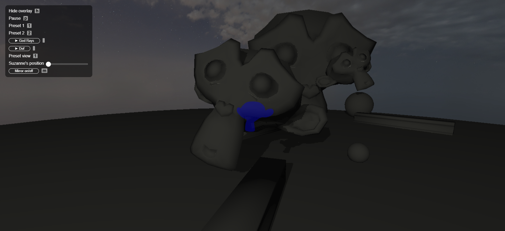

   _Baseline rendering without DoF; all elements appear in sharp focus in `dof_scene`._

   

   _Baseline rendering with DoF with Default Value (`minFocusDistance`=5 and `maxFocusDistance`= 100) in `dof_scene`._

    <video src="images/Dof/DofOff.mp4" width="500" controls>
        Your browser does not support the video tag.
    </video>

   _Baseline rendering without DoF; all elements appear in sharp focus in the main Scene._

    <video src="images/Dof/DoFDefault.mp4" width="500" controls>
        Your browser does not support the video tag.
    </video>

   _Baseline rendering with DoF with Default Value (`minFocusDistance`=5 and `maxFocusDistance`= 100) in the main scene._

**2. Focal Band Test**

In order to show you, we placed three spheres at depths **25 u**, **75 u**, and **150 u** in a simple scene. To focus on each sphere in turn (using our UI sliders `minFocusDistance ∈ [0,50]`, `maxFocusDistance ∈ [10,200]`), we center a “focal band” around each distance so that:

- Fragments at or closer than **minFocusDistance** are fully sharp (focus = 0).
- Fragments at or beyond **maxFocusDistance** are fully blurred (focus = 1).
- Fragments in between smoothly transition.

| Target Sphere | Band Settings                                      | minFocusDistance | maxFocusDistance |
| :-----------: | :------------------------------------------------- | :--------------: | :--------------: |
|  Near (25 u)  | Center band \[0–50] so 25 u sits in the middle     |        0         |        50        |
|  Mid (75 u)   | Center band \[50–100] so 75 u sits in the middle   |        50        |       100        |
|  Far (150 u)  | Center band \[100–200] so 150 u sits in the middle |       100        |       200        |

<table>
  <thead>
    <tr>
      <th>Focused on Near</th>
      <th>Focused on Mid</th>
      <th>Focused on Far</th>
    </tr>
  </thead>
  <tbody>
    <tr>
      <td>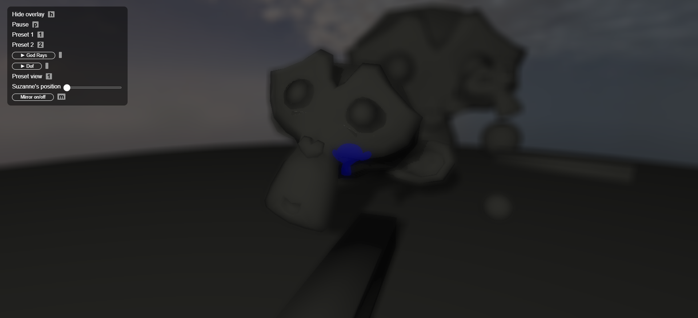</td>
      <td></td>
      <td>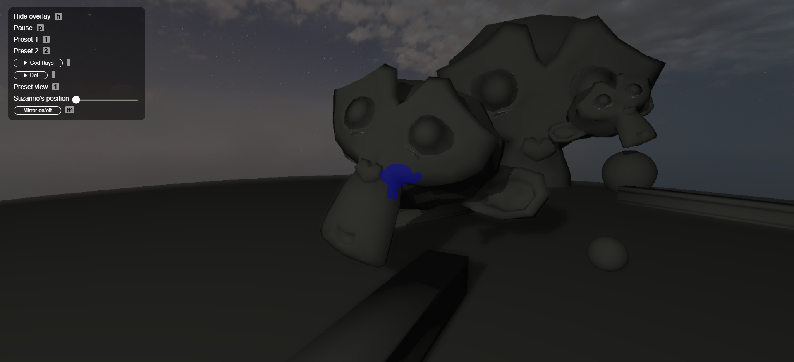</td>
    </tr>
    <tr>
      <td>
        <video src="images/Dof/Near.mp4" width="500" controls>
          Your browser does not support the video tag.
        </video>
      </td>
      <td>
        <video src="images/Dof/Mid.mp4" width="500" controls>
          Your browser does not support the video tag.
        </video>
      </td>
      <td>
        <video src="images/Dof/Far.mp4" width="500" controls>
          Your browser does not support the video tag.
        </video>
      </td>
    </tr>
  </tbody>
</table>

> **Note**: The camera position was kept identical for all three tests, so the blur in the “Focused on Far” still is subtle. Please refer to the Far video above for a clearer demonstration of the effect.

Here, each band width Δ is chosen so that $D$ (the sphere’s depth) lies at the center of $[\min,\max]$. In practice:

$$
\min = D - \tfrac{\Delta}{2},
\quad
\max = D + \tfrac{\Delta}{2}
$$

Using Δ = 50 u for Near and Mid tests, and Δ = 100 u for the Far test, ensures all values stay within our slider limits while isolating each sphere in focus.

In each test the focal band settings correctly isolate the target sphere in focus while blurring the others. The smoothstep transition produces a natural blend between sharp and blurred regions. These results can be seen clearly in both the still images and the accompanying videos.

### God Rays (Volumetric Lighting)

#### Implementation

The idea behind our volumetric lighting is relatively simple, we use a 3d noise function and sample it to approximate our fog. The sampling method is heavily inspired by the advanced computer graphics course from the University of Tartu (see Volumetric-Rendering in references). The method essentially consists in raymarching in a given cube and collecting the density of the fog at each step given by our 3d noise function.


We then sum each of the samples and weigh them based on their transmittance, the intensity of the light and the step size (here $\Delta s$).
In the image, we see $t_0*t_1*t_2*t_3$, this product forms the transmittance. Where $t_i=e^{extinctionCoef~*~fogDensity~*~stepsize}$. The extinction coefficient regulates how dense our fog is. We have for a fragment:

$$
transmittance = \prod_{i=0}^{step~number} t_i
$$

There are two light sources: ambient and direct. Ambient light is a constant. Direct light on the other hand is a bit more complicated. It's meant to be the amount of light that reaches the point we are sampling from a spotlight.


Although, in the picture the angle between the sample direction and light direction appears, we do not use it. Instead, with $d$ the distance between our sample point and spotlight, we do:

$$
directLight = lightStrength / d^2
$$

This gives us a spherical spotlight. Except, we want to simulate godrays. So to add some flavor to our light, we take the unit direction vector from our light to the sample position and pass it through a 3d noise function. Multiplied by our current light value and we have a light that shines through certain areas and not others seemingly at random. This gives us our wonderful rays of light! Our final formula is

$$
directLight = lightStrength * noise(lightDirection) / d^2
$$

To change how much light dissipates through the fog, we add an outscattering factor which is the product of the density at our sample point and of the scattering coefficient. Our light coefficient is:

$$
light = (ambient + direct) * scatteringCoef*density(samplePos)
$$

All of these factors taken into account, in the case of our fragment shader, we have:

$$
pixelColor = \sum_{k=0}^{nb~steps}transmittance_k*light_k*stepSize_k
$$

Because these calculations need to be done for every fragment and $nb~steps$ times, this shader can be fairly heavy on the gpu. To optimize our algorithm, we used a non-constant step size. At each step, we grow the step size. For a step $i$ our step size is simply $i * stepSize$. This means the front part of our fog is more precise while what is seen in the back is more approximated.

**Shaders**

In this section, we present each part of our shader code to explain how it's done in glsl. We first pass as uniforms, the number of steps, step size, coefficients, light position, color and strength, camera position and other modifiers to improve the visual quality of our fog.

The density function used for our fog is:

```glsl
float density3d(vec3 p) {
	vec3 offset = vec3(0.3, 0.1, 0.2) * time * 10.;

	return (fbm3(p + offset, frequency, num_octaves) + normalization) * edgeFalloff(p, box_size, 20.) * 0.5;
}
```

`fbm3` is our noise function. It's a simple Fractional Brownian motion implementation. The offset is a hardcoded value that we move linearly in time to make the fog less static. To the resulting noise we add normalization a parameter given as a uniform to make sure there is density in most areas and not just patches of smoke. We also have an `edgeFalloff` function. This just makes our fog less dense on the side of the cube.

For our light function, we do:

```glsl
float get_light_intensity(vec3 pos, vec3 light_pos) {
	float dist = length(pos - light_pos);
	vec3 light_dir = normalize(pos - light_pos);

	vec3 offset = vec3(0.1, 0.3, 0.4) * time / 8.;
	float smog = fbm3(light_dir + offset, 10., 1);

	if(sphere_light == 1) {
		smog = 1.0;
	}
	return max(0.0, light_strength * smog / (dist * dist));
}
```

We reuse the `fbm3` method with a lower hardcoded frequency to achieve our beautiful god rays. If we have sphere light active we don't make rays. An offset is applied as it is for the fog, this gives a nice shimmer to our render.

The raymarching loop:

```glsl
	int num_steps = 0;
	float current_step_size;

	for(int i = 0; i < 1000; i++) {

		current_step_size = get_current_step_size(num_steps, step_size);

		//raymarch
		samplePos += cam_dir * current_step_size;

		if(num_steps >= max_step || !is_in_cube(samplePos, vec3(0., 0., 0.), box_size)) {
			break;
		}

		// transmitance
		float currentDensity = density3d(samplePos);
		transmittance *= exp(-currentDensity * extinction_coeff * current_step_size);

		float light_intensity = get_light_intensity(samplePos, light_pos);

		vec3 in_scatter = ambient_light + light_intensity * light_color;
		float out_scatter = scattering_coeff * currentDensity;

		vec3 currentLight = in_scatter * out_scatter;

		illumination += transmittance * currentLight * current_step_size;

		num_steps++;
	}
```

We will not go into too much detail, but this is practically a direct implementation of the above algorithm.

All this glsl code is in the godrays fragment shader. This shader is run and its contents are put into a 2d texture later used as a sampler2D in the map_mixer shader to mix with the blinn_phong rendering. We do the mixing at the end of our render. Why? We need to remember we're rendering an aquarium and that the camera can go inside to see the fish, so we want the fog to be rendered above the fish. Adding the rendered fog texture at the end allows us to do that.

#### Validation

To validate this feature we can play with different parameters see how they affect the environement.
First let's see the number of steps of the raymarching process. When we play with the number of steps we can see this fog appear. This implementation of the fog was necessary for us to be able to create some density in the environment which will be affected by the step size as we will see next.

<div style="text-align: center;">
<video height="300" autoplay loop muted playsinline>
	<source src="videos/godrays/maxsteps.mp4" type="video/mp4" />
	Your browser does not support the video tag.
</video>
</div>
<figcaption style="text-align: center;">Number of steps manipulation.</figcaption>

The number of steps determines how many sample points are taken along a ray as it travels through the volume. Naturally it is the parameter that determines the density of the fog inside the cube which can be observed below.

<div style="text-align: center;">
<video height="300" autoplay loop muted playsinline>
	<source src="videos/godrays/stepsize.mp4" type="video/mp4" />
	Your browser does not support the video tag.
</video>
</div>
<figcaption style="text-align: center;">Step size manipulation.</figcaption>

Next we can look at the extinction coefficient which represents the combined effect of absorbtion and out-scattering in the volume. Which means if this coefficient is high, the light fades faster and when it is lower, the light travels further. This effect is also translated by some change of intensity of the light. All this can be seen below.

<div style="text-align: center;">
<video height="300" autoplay loop muted playsinline>
	<source src="videos/godrays/absorbtion.mp4" type="video/mp4" />
	Your browser does not support the video tag.
</video>
</div>
<figcaption style="text-align: center;">Exctinction Coefficient manipulation.</figcaption>

The scattering coefficient controls how much light is redirected. This means that the higher the coefficient the more light is scattered in the volume. We can see below that we obtained the desired result.

<div style="text-align: center;">
<video height="300" autoplay loop muted playsinline>
	<source src="videos/godrays/scattering.mp4" type="video/mp4" />
	Your browser does not support the video tag.
</video>
</div>
<figcaption style="text-align: center;">Scattering Coefficient manipulation.</figcaption>

Light rays appear instead of a uniform glow because the directional light is partially blocked by objects, and there's fog or dust in the air. This causes light to scatter along specific paths, making the beams of light visible as it travels through the gaps.

<div style="text-align: center;">
<video height="300" autoplay loop muted playsinline>
	<source src="videos/godrays/spherelight.mp4" type="video/mp4" />
	Your browser does not support the video tag.
</video>
</div>
<figcaption style="text-align: center;">With and without Rays.</figcaption>

We can look at this through the noise function we used for our rays.

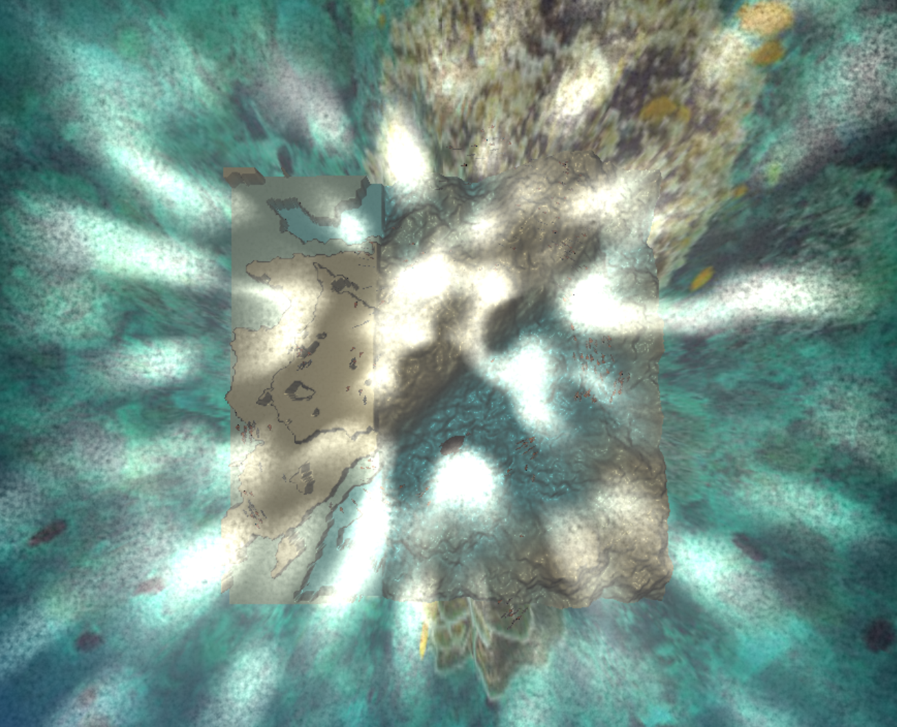{width="500px"}

Adjusting the noise function alters the shape, motion, and realism of volumetric rays. It controls how light interacts with an uneven or dynamic medium, adding detail, breakup, and life to what would otherwise be smooth, uniform shafts of light.

<div style="text-align: center;">
<video height="300" autoplay loop muted playsinline>
	<source src="videos/godrays/frequency.mp4" type="video/mp4" />
	Your browser does not support the video tag.
</video>
</div>
<figcaption style="text-align: center;">Frequency of the Noise Function.</figcaption>

To prove that our noise function is 3D we can look at the picture below where we rendered the as said "fog" above a fish.

{width="500px"}

### Boids

#### Implementation

Our boids function on three core principles alignment, cohesion and separation. They in turn give the fish an acceleration which changes the velocity, which changes the position akin to basic mechanics. Fish will only consider their neighbours when adhering to these principles. To be considered a neighbour you need to be below a maximum distance (we use 12, but it's arbitrary).

1. Alignment makes fish keep the same direction. To get its value we simply get the average velocity of the neighbouring fish.
2. Cohesion makes fish come together. To get its value we get the average positions of the neighbouring fish.
3. Separation handles the spacing between the fish. If a fish comes closer than 6 units, then a force in the opposite direction is applied. The force is scaled linearly to the inverse of the distance between the two to avoid sharp turns. The sum of each force for each fish that is too close.

We also want our fish to stay within a certain area, so we also apply a force away from the walls of our cube if the fish get closer than a certain margin. To avoid the fish simply bouncing back and forth on the walls we also add a small attraction to the center of the cube. These modifiers and the 3 others are with a certain weight.

All of our calculations are done by the CPU so we can only support up to about 200 boids before having a noticeable drop in performance.

A predator was added to the scene. It acts the same way as a boid does except other boids will avoid it. To add this avoidance we simply apply a force away from the predator when it gets to close.

#### Validation

In the following videos we vary the weight of each principle to highlight them.

<div style="text-align: center;">
<video height="300" autoplay loop muted playsinline>
	<source src="videos/boids/cohesion.mp4" type="video/mp4" />
	Your browser does not support the video tag.
</video>
</div>
<figcaption style="text-align: center;">Boids Cohesion</figcaption>

We go from a low cohesion to high cohesion, we can see the fish go from separate to extremely close together.

<div style="text-align: center;">
<video height="300" autoplay loop muted playsinline>
	<source src="videos/boids/alignment.mp4" type="video/mp4" />
	Your browser does not support the video tag.
</video>
</div>
<figcaption style="text-align: center;">Boids Alignment</figcaption>

Here we go from low alignment to high alignment. We can see the fishs align themselves into a large group.

<div style="text-align: center;">
<video height="300" autoplay loop muted playsinline>
	<source src="videos/boids/separation.mp4" type="video/mp4" />
	Your browser does not support the video tag.
</video>
</div>
<figcaption style="text-align: center;">Boids Separation</figcaption>

We vary the separation between the fish and we can see them separate and join back.

<div style="text-align: center;">
<video height="300" autoplay loop muted playsinline>
	<source src="videos/boids/WallAvoidance.mp4" type="video/mp4" />
	Your browser does not support the video tag.
</video>
</div>
<figcaption style="text-align: center;">Wall Avoidance</figcaption>

A small cube is used to show the repulsion more effectively. We can all the fish stay within it's walls.

<div style="text-align: center;">
<video height="300" autoplay loop muted playsinline>
	<source src="videos/boids/centerattraction.mp4" type="video/mp4" />
	Your browser does not support the video tag.
</video>
</div>
<figcaption style="text-align: center;">Center Attraction</figcaption>

Even though the predator is scaring them away, they always try to come back to the center.

<div style="text-align: center;">
<video height="300" autoplay loop muted playsinline>
	<source src="videos/boids/predatorFear.mp4" type="video/mp4" />
	Your browser does not support the video tag.
</video>
</div>
<figcaption style="text-align: center;">Predator Repulsion</figcaption>

Although we could see the predator chasing away the fish in the previous video, here is another video showing this. When the angler fish approachs the boids, they move away.

### Meshes : Fishes

#### Implementation

For our project we used 3 types of meshes, two fishes that we took from existing sources and one that we created ourselves.

##### Basic fish

The first fish was taken from the [Trout Fish Model](https://free3d.com/3d-model/3d-fish-model-low-poly-63627.html) source. The mesh is really complex and we needed some good looking fish to fill up the aquarium. Here we can see the mesh from the front and from the side:

{width="300px"}

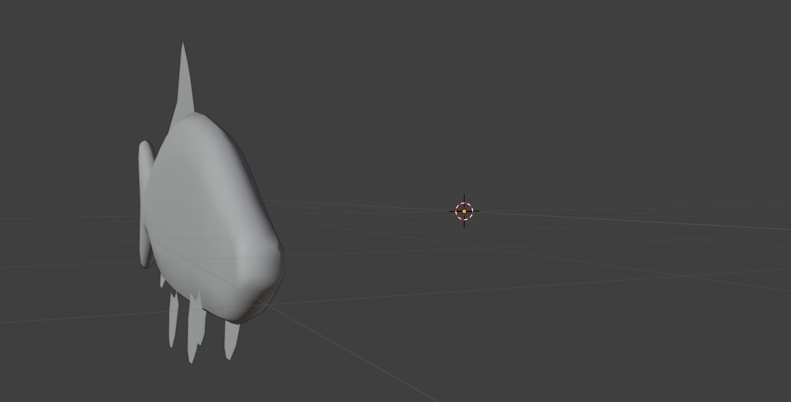{width="300px"}

There was also some texture so we decided to use it.

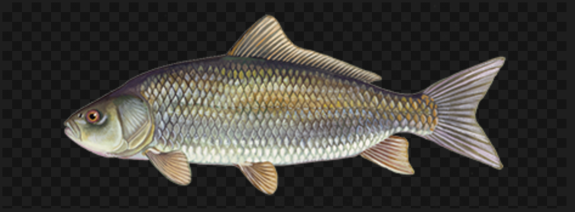{width="300px"}

##### Nemo fish

The second fish was taken from the [Nemo 3D Model](https://skfb.ly/oGLDL) source. It is a precise mesh of the [Finding Nemo](https://en.wikipedia.org/wiki/Finding_Nemo) film. Here we can see the front and side view of the mesh.

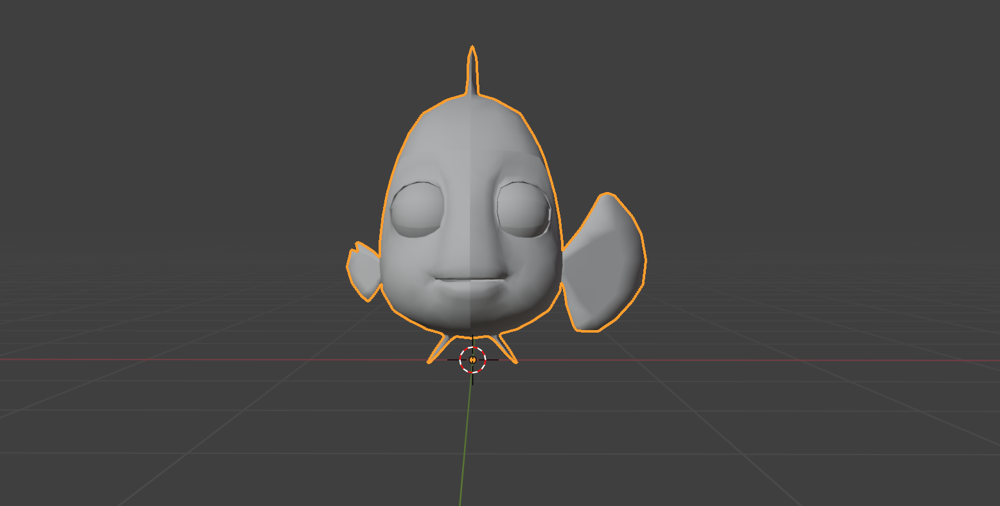{width="300px"}

{width="300px"}

As before there was some provided texture for this mesh.

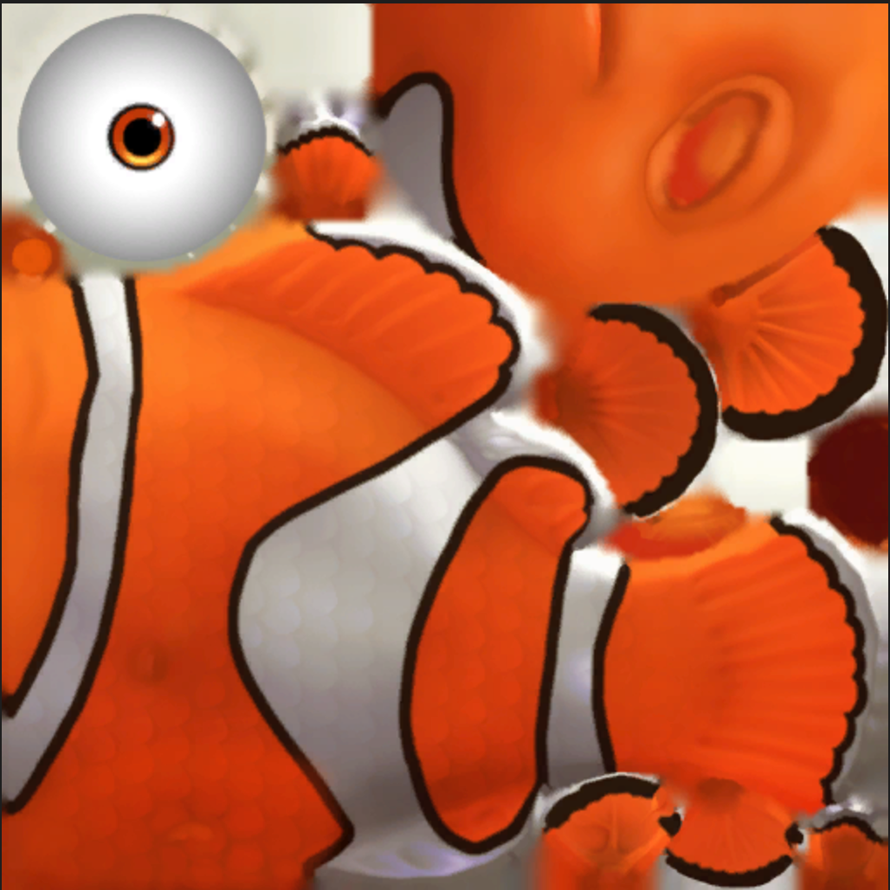{width="300px"}

##### Angler fish

The angler fish is the only fish we made ourselves. We didn't find any fish that could perfectly look like [this angler fish](https://www.etsy.com/listing/1264148113/deep-water-angler-fish):

{width="300px"}

So we started by modeling the fish in a way that looks something like the fish above. You can see the result below

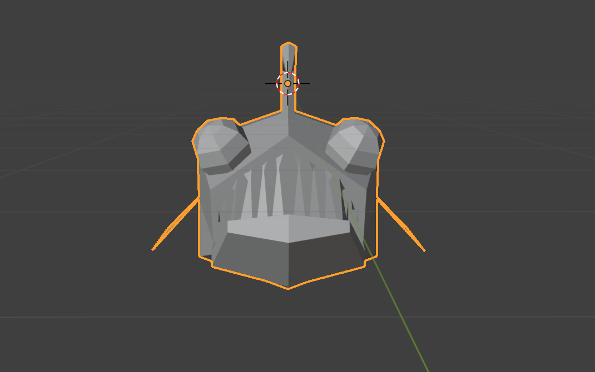{width="300px"}

{width="300px"}

The texture of the fish was designed such that it is brown and dark since this type of fish usually swims in deeper water.

{width="300px"}

This is the fish that will represent the predator in our scene. The other fishes will have to escape from this one. The most hard modeling were the teeth. Also we modeled the fish a bit lower than the original blender line since we wanted to have a light displayed above it to simulate the little lantern of the orginal fish.

#### Validation

Let's first take the normal fish. We can look at the texture with the mesh assignment and see that the texture corresponds to the fish mesh.

{width="300px"}

Then when we look at it in our scene we can see that the model is displayed correctly.

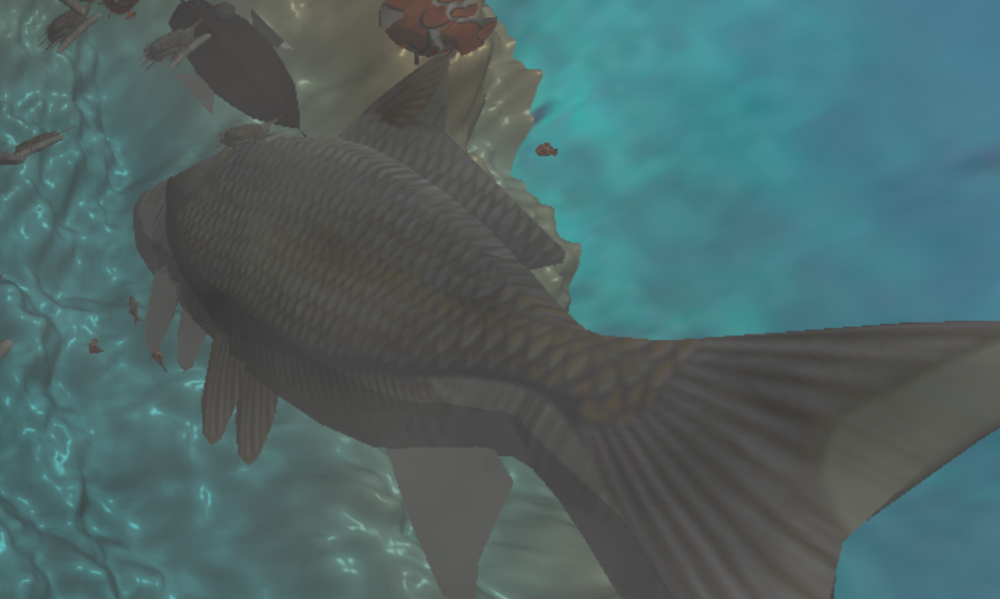{width="300px"}

For the nemo fish we can look at the same mesh on texture image and see that the texture corresponds to the mesh.

{width="300px"}

And the in the scene it displays correctly.

{width="300px"}

To validate the angler fish we can look at how we assigned the texture:

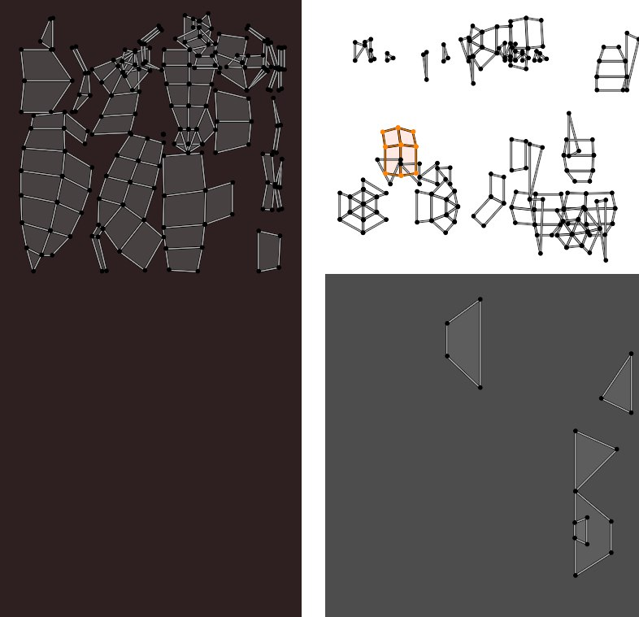{width="300px"}

And that the texture displays correctly in the scene:

{width="300px"}

## Discussion

### Additional Components

We also added a transparent material intended to show the border of the aquarium except it was not visually compatible with the godrays. To implement it we simply render the transparent part at the end similar to a post-processing effect.

{width="500px"}

### Failed Experiments

The original university course we followed for the godrays also suggested using raymarching towards the light to get it's intensity. This method would have greatly increased the computational demand of our rays. We decided instead to use a the cheaper method using noise told above.

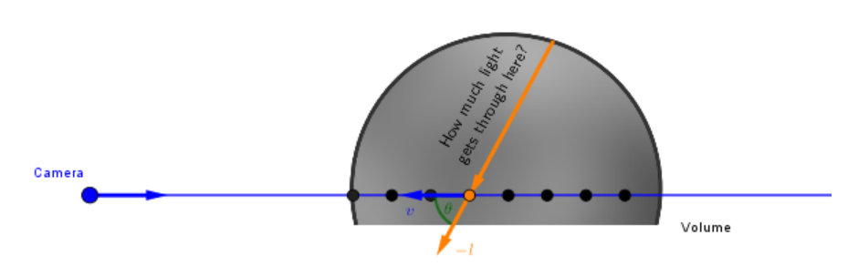

### Challenges

One of our most challenging endeavors was working with the Turntable camera. We didn't take the time to make a new implementation of the camera and scrambled together methods to use cartesian coordinates.

## Contributions

<table>
	<caption>Worked hours</caption>
	<thead>
		<tr>
			<th>Name</th>
			<th>Week 1</th>
			<th>Week 2</th>
			<th>Week 3</th>
			<th>Week 4</th>
			<th>Week 5</th>
			<th>Week 6</th>
			<th>Week 7</th>
			<th>Total</th>
		</tr>
	</thead>
	<tbody>
		<tr>
			<td>Erik Hübner</td>
			<td>5h</td>
			<td style="background-color: #f0f0f0;"></td>
			<td>8h</td>
			<td>8h</td>
			<td>10h</td>
			<td>8h</td>
			<td>8h</td>
			<td>47h</td>
		</tr>
		<tr>
			<td>Youcef Amar</td>
			<td>4h</td>
			<td style="background-color: #f0f0f0;"></td>
			<td>9h</td>
			<td>8h</td>
			<td>9h</td>
			<td>11h</td>
			<td>8h</td>
			<td>49h</td>
		</tr>
		<tr>
			<td>André Cadet</td>
			<td>4h</td>
			<td style="background-color: #f0f0f0;"></td>
			<td>7h</td>
			<td>9h</td>
			<td>10h</td>
			<td>9h</td>
			<td>8h</td>
			<td>47h</td>
		</tr>
	</tbody>
</table>

<table>
	<caption>Individual contributions</caption>
	<thead>
		<tr>
			<th>Name</th>
			<th>Contribution</th>
		</tr>
	</thead>
	<tbody>
		<tr>
			<td>Erik Hübner</td>
			<td>1/3</td>
		</tr>
		<tr>
			<td>Youcef Amar</td>
			<td>1/3</td>
		</tr>
		<tr>
			<td>André Cadet</td>
			<td>1/3</td>
		</tr>
	</tbody>
</table>

## References

[Volumetric-Rendering](https://cglearn.eu/pub/advanced-computer-graphics/volumetric-rendering)

[Depth of Field](https://lettier.github.io/3d-game-shaders-for-beginners/depth-of-field.html)

[Trout Fish Model](https://free3d.com/3d-model/3d-fish-model-low-poly-63627.html)

[Nemo 3D Model](https://skfb.ly/oGLDL)

[Angler fish inspiration](https://www.etsy.com/listing/1264148113/deep-water-angler-fish)
